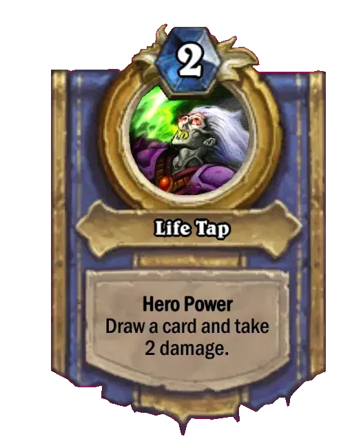

## Oryginalna treść tematu:

```
Celem pracy jest stworzenie uproszczonej wersji Hearthstone. Działa zagrywanie kart,
wykonywanie ataków przy użyciu przyzwanych stworzeń, wyświetlanie obecnych statystyk graczy
(zdrowie, mana, stan pola), a także specyficzne mechaniki kart.
Należy skupić się na stworzeniu sztucznej inteligencji jak najefektywniej operującej
daną jej talią kart w celu osiągnięcia zwycięstwa.
Zakres prac:
1) Przegląd przydatnych algorytmów i bibliotek
2) Zaprojektowanie, implementacja i testy aplikacji.
3) Wytrenowanie AI.

Narzędzia:
Komputer PC, Linux, C++ i ewentualnie Python3.
```

## Wybrane uproszczenie:

Wybranym przeze mnie zawężeniem zawartości gry jest ograniczenie się do kart w stanie z patcha 1.0.0.5834 z 30 czerwca 2014r. Ów patch stanowił podstawę dla utworzenego w grze [trybu klasycznego](https://hearthstone.fandom.com/wiki/Classic_format), który to funkcjonował w grze w latach 2021-2023, przed byciem usuniętym przez Blizzard Entertainment w związku z niskim zaangażowaniem w niego graczy. Ze względu na względnie małą pulę kart i fakt że powstawały talie specyficznie zkrojone pod nią stanowi on moim zdaniem świetną podstawę dla ww. zadania. Jako że chcę skupić się na nauczeniu agenta grać karty odpowiednio, a nie tworzyć własne talie, koniecznym nie jest zaimplementowanie całego zbioru klasycznego kart, a jedynie te składające się na wybrane do nauki przez AI talie.

## Krótki opis mechaniki gry

Wszystkie karty wymagają zapłacenia pewnego kosztu many, aby możliwe było jej zagranie. Dzielą się one na trzy zasadnicze kategorie: stronników, zaklęcia i bronie.

<div style="page-break-after: always;"></div>

#### Stronnicy
[<p align="center">](Voidwalker)

Stronnicy posiadają atak i zdrowie. Podczas swojej tury gracz może raz zaatakować kontrolowanym stronnikiem w wybranenego wrogiego stronnika (wtedy od zdrowia obydwu stronników odejmowany jest atak przeciwnika), bądź wrogiego bohatera (wtedy wyłącznie bohater otrzymuje obrażenia).

Różni stronnicy posiadają swoje własne unikalne efekty, a także współdzielone przez wielu stronników opisane za pomocą słów kluczowych np.
- Prowokacja (Taunt) - przeciwnik nie może atakować innych stronników póki ten żyje
- Okrzyk bojowy (Battlecry) - efekt opisany po tym słowie wykonuje się w momencie zagrania stronnika na plansze
- Agonia (Deathrattle) - efekt opisany po tym słowie wykonuje się w momencie śmierci stronnika
- i wiele innych ...

Niektórzy stronnicy przynależą też do danej rasy (wymienionej na dole karty), co może mieć wpływ na niektóre efekty kart.

#### Zaklęcia
[<p align="center">](Fireball)

Zaklęcia wykonują efekt opisany treścią ich karty. Np. zaprezentowane zaklęcie "Kula ognia" pozwala graczowi wybrać dowolny cel i zadać mu 6 pkt. obrażeń. W odróżnieniu od stronników zaklęcia zazwyczaj różnią się znacząco efektami i ciężko jest podzielić je słowami kluczowymi na podkategorie.

[<p align="center">](Explosive_Trap)

Szczególny podtyp zaklęcia stanowią tzw. Sekrety. Nie wpływają one na pole w momencie zagrania, lecz posiadają warunek pod którym mogą się aktywować w trakcie wykonywania dowolnej akcji.

#### Bronie
[<p align="center">](Fiery_War_Axe)

Broń posiada dwie główne statystyki: atak i wytrzymałość. Założenie broni przez gracza pozwala mu raz na turę wykonać atak, tak jakby był stronnikiem. Wytrzymałość opisuje ile razy może zostać użyta zanim zostanie zniszczona.

<div style="page-break-after: always;"></div>

#### Moc bohatera
[<p align="center">](Hero_Power)

Każdy bohater posiada charakterystyczną dla swojej klasy moc bohatera. Po zapłaceniu jej kosztu gracz może wykorzystać jej efekt raz na turę.

#### Zmęczenie
[<p align="center">](Fatigue)

Próba dobrania karty z pustej talii, aplikuje na gracza dobierającego obrażenia za zmęczenie. Rosną one o 1 za każdą następną kartę dobraną z pustej talii

<div style="page-break-after: always;"></div>

#### Pętla gry
[<p align="center">](Hearthstone_board)

Obydwaj gracze zaczynają grę z 30 punktami zdrowia bohatera, zerową liczbą kryształów many (których to ilość wzrasta o 1 na początku każdej tury, aż do maksimum 10 i odnawia się po zakończeniu tury). Na początku gry dochodzi do pierwszego dobrania kart, gdzie pierwszemu i drugiemu graczowi zostają zaprezentowane odpowiednio 3 i 4 karty, z możliwością odrzucenia części z nich i dobrania innych z talii. Gracz zaczynający drugi otrzymuje ponadto kartę "Moneta" - zaklęcie o koszcie 0 dodające graczowi jednorazowo 1 kryształ many do końca tury.

Na początku każdej tury gracz, który ma rozgrywać daną turę dobiera jedną kartę. Tury rozgrywane są przez graczy naprzemiennie i kończą się, gdy zostanie naciśnięty przycisk zakończenia tury (co w sytuacji nie posiadania wystarczających środków na zagranie żadnych kart pozostaje jedynym możliwym zagraniem).

Gra kończy się, gdy punkty zdrowia któregokolwiek z bohaterów spadną do 0 i drugi zostanie uznany za zwycięzcę, bądź zostanie osiągnięty limit 90 tur, po którym dochodzi do remisu. Wykonanie akcji która sprowadzi zdrowie obydwu bohaterów do 0 jednocześnie również kończy się remisem.

## Dotychczasowe eksperymenty przeprowadzane w tej dziedzinie

Powstało wiele prac naukowych skupiających się na wykorzystaniu wszelkiego rodzaju AI, a zwłaszcza algorytmów opartych na ewolucji zarówno do tworzenia talii: [Playtesting używający metod ewolucyjnych do testowania potencjalnych talii](https://www.sciencedirect.com/science/article/pii/S0950705118301953), [Tworzenie talii metodą ewolucyjną](https://ieeexplore.ieee.org/abstract/document/7860426), kontrolowania agentów grających: [Podejmowanie decyzji algorytmem ewolucyjnym](https://www.scitepress.org/Papers/2023/117839/117839.pdf), czy też balansu gry: [Ewoluowanie Mety](https://ieeexplore.ieee.org/abstract/document/8847966).

Moją uwagę szczególnie przykuło podejście opisane w [Optimizing Hearthstone agents using an evolutionary algorithm](https://www.sciencedirect.com/science/article/pii/S0950705119304356), jako że wydało mi się być dość naturalne do zaprezentowanego problemu. Metodę wykorzystaną przez autorów tej pracy można streścić następująco: ekstrahują z obecnego stanu gry kluczowe wartości i wykorzystują w ten sposób powstały wektor jako wejście do prostego algorytmu ewolucyjnego realizującego problem regresji poprzez ważoną sumę podanych mu wartości, gdzie osobniki stanowią wektory wag owej sumy. Wynik jest następnie przekazywany do prostego agenta, wybierającego akcję o najwyższym wyniku. Do ewaluacji agentów stosują oni metodę koewolucyjną współzawodniczą, polegająco na tym że wszyscy agenci z różnych grup (po grupie na talię) rozgrywają mecze przeciwko sobie, które są oceniane zgodnie z następującym schematem: {1: zwycięstwo, 0: w przeciwnym przypadku}, a łączna suma zdobytych punktów jest używana jako funkcja oceny danego osobnika.

## Planowane działania

W ramach mojej pracy chciałbym niejako pójść o krok dalej z ww. pracą i zastosować do podobnie zdefiniowanego problemu regresji algorythm NEAT, który pozwala na ewolucyjne tworzenie sieci neuronowych, będących moim zdaniem całkiem naturalnym krokiem naprzód względem prostej sumy ważonej, poprzez wprowadzenie kombinacji wejść i nieliniowości do całego systemu oceny akcji. W celu sprawdzenia, czy jest to faktycznie poprawa względem podstawowej metody, zamierzam porównać uzyskane obydwoma metodami wyniki. Rozważam również rozwinięcie logiki agenta do optymalizacji nie wyłącznie następnego ruchu, ale całej tury, bądź wykorzystanie metod typu "Monte-Carlo tree search" dla lepszego podejmowania decyzji.

#### Struktura danych wejściowych

Całościowy wektor wejściowy sieci składałby się z następujących części:

- odnośnie bohaterów
    - zdrowie
    - pancerz
    - siła ataku
    - pozostała wytrzymałość broni
    - ilość sekretów nałożonych na bohatera
- odnośnie stronników na polu
    - zdrowie
    - atak
    - słowa kluczowe (dla każdego 1 jeżeli posiada, 0  w przeciwnym przypadku)
- globalnie
    - ilość kart w ręce
    - ilość kart w talii
    - posiadana mana

Wyżej wymienione części są zduplikowane dla oponenta i odpowiednio odejmowane od łącznej oceny stanu gry (jako że korzyść przeciwnika stanowi naszą niekorzyść).

Istnieją ponadto cechy których ocena nie jest możliwa dla obydwu stron.
- odnośnie stronników w ręce
    - zdrowie
    - atak
    - słowa kluczowe
    - koszt many

- odnośnie zaklęć w ręce
    - koszt

- odnośnie broni w ręce
    - wytrzymałość
    - atak
    - koszt

Ocena tych cech wykonywana jest jedynie dla gracza rozgrywającego turę, nie dla jego przeciwnika, jako że te informacje nie powinny być możliwe do pozyskania dla prawdziwego gracza (nie mamy wglądu w rękę przeciwnika).

#### Metoda działania agenta (w schemacie optymalizacji pojedynczej akcji)

Przed wykonaniem ruchu agent odpytuje grę o listę możliwych do wykonania obecnie akcji. Następnie dla każdej możliwej akcji symulowane jest nałożenie jej na pole i oceniany jest powstały w jej wyniku stan gry. Dla efektów losowych (np. dobranie karty z talii, czy aktywacja sekretu) oceniane są wszystkie możliwe stany gry po danym zagraniu, a finalna ocena stanowi ich średnią. Następnie agent wybiera najwyżej ocenianą akcję i stosuje ją na pole.

Do akcji zalicza się:
- zagranie stronnika z ręki na określoną pozycję planszy (jeżeli karta wymaga wybrania celu powstaje osobna akcja dla każdego celu)
- zagranie zaklęcia z ręki (akcje zależne od potrzeby wyboru celu jak wyżej)
- zagranie broni z ręki
- użycie mocy bohatera (niektóre wymagają wybrania celu)
- atak bohaterem/stronnikiem w wybranego wrogiego bohatera/stronnika
- zakończenie tury

#### Ocena agenta

Wstępnie, nie planuję zmieniać metody oceny agentów w porównaniu z oryginalną pracą (tj. {zwycięstwo: 1, remis lub porażka: 0}, każdy gra na każdego), chyba że czas obliczeń algorythm okaże się być niewspółmierny do obserwowanej poprawy działania, wtedy rozważę ograniczenie oceny do rozgrywania meczy na k najlepszych osobników z każdej populacji.

## Technologie

Jako główny język implementacji gry planuję użyć C++, ze względu na szybkość jego działania, wsparcie dla paradygmatów programowania obiektowego (przydatnych do tworzenia hierarchii kart) i moją osobistą znajomość jego działania.

Do zaimplementowania samego algorytmu NEAT rozważam wykorzystanie gotowej biblioteki, jeżeli uda się w stosunkowo prosty sposób dostosować ją do funkcjonowania na kilku populacjach jednocześnie z "wspólną" funkcją oceny. W przeciwnym wypadku zaimplementuję ów algorytm własnoręcznie w C++.
